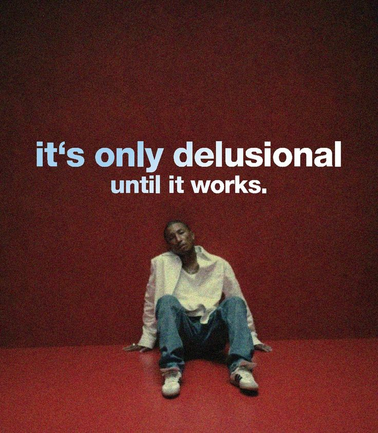
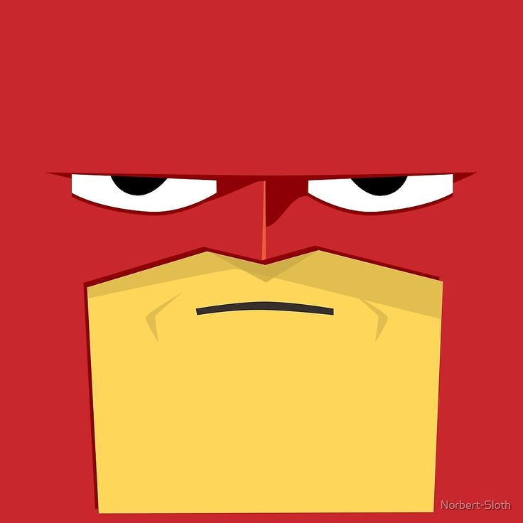
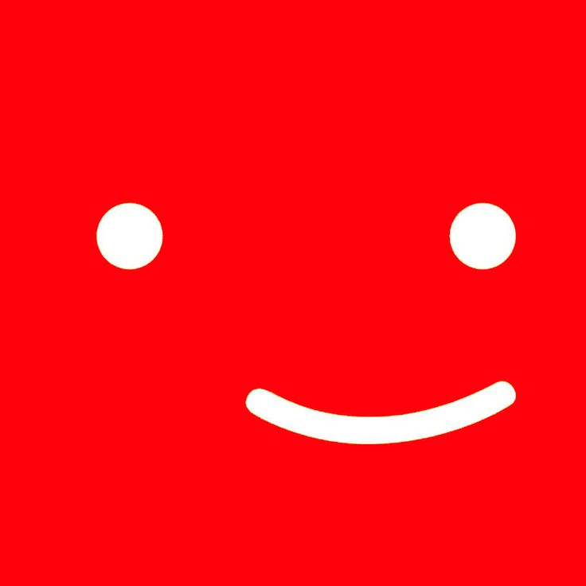

# StreamVallabh Portfolio

<div align="center">
  
  <br>
  <h3>A Netflix-inspired interactive portfolio experience</h3>
  
  
  
  
  
  
</div>

## 📋 Overview

StreamVallabh is a creative Netflix-inspired portfolio website that offers a unique viewing experience through multiple user profiles. Choose between different personas to explore my skills, projects, and experience from different perspectives.

<div align="center">
  
  
  
  
</div>

## ✨ Features

### 🎬 Netflix-Inspired Experience
- **Iconic Splash Screen**: Complete with the signature Netflix sound
- **Profile Selection**: Choose your viewing experience (Recruiter, Developer, Stalker, or Blog)
- **Responsive Layout**: Works on devices of all sizes

### 👔 For Recruiters
- Professional view of skills, experience and projects
- Detailed project showcases with technology stacks
- Resume download option

<div align="center">
  
  
</div>

### 💻 For Developers
- Interactive terminal with executable commands
- Built-in games like Snake, Code Breaker, and more
- 3D solar system visualization
- Detailed technical breakdowns of projects

<div align="center">
  
  
  
  
</div>

### 📝 For Readers (Blog)
- **Markdown-Based Blog**: Write posts in simple markdown files
- **Tag-Based Organization**: Filter posts by topics
- **Rich Content Support**: Images, code blocks, and formatted text
- **Fast & Simple**: No CMS complexity - just edit files and commit!

### 🔍 Additional Features
- Interactive AI chatbot for questions
- Animated UI elements with Framer Motion
- Responsive design for all device sizes
- SEO optimization

## 🚀 Technologies

### Frontend
- **React 18**: Core framework
- **Vite**: Build tool
- **React Router**: For navigation
- **Framer Motion**: For smooth animations
- **TailwindCSS**: For styling
- **Three.js & React Three Fiber**: For 3D elements
- **Radix UI**: For accessible UI components
- **React Markdown**: For blog post rendering

### Other Tools
- **Web Audio API**: For splash screen audio
- **React Helmet**: For SEO optimization
- **Swiper**: For carousel components
- **Formspree**: For contact form
- **Gray Matter**: For parsing markdown front matter

## 🛠️ Installation & Setup

1. Clone the repository
   ```bash
   git clone https://github.com/your-username/netflix-portfolio.git
   cd netflix-portfolio
   ```

2. Install dependencies
   ```bash
   npm install
   ```

3. Run the development server
   ```bash
   npm run dev
   ```

4. Build for production
   ```bash
   npm run build
   ```

## ✍️ Blogging with Markdown

The blog uses **Markdown files** stored in the `content/blog/` directory. It's simple, fast, and version-controlled!

### Creating a Blog Post

1. **Create a new markdown file** in `content/blog/` with a descriptive filename (e.g., `my-awesome-post.md`)

2. **Add front matter** at the top of the file:
   ```markdown
   ---
   title: "My Awesome Post"
   excerpt: "A brief description of what this post is about"
   publishDate: "2025-01-15"
   tags: ["technology", "web-development"]
   heroImage: "/path/to/image.jpg"
   ---
   ```

3. **Write your content** in Markdown:
   ```markdown
   # My First Heading
   
   This is a paragraph with **bold** and *italic* text.
   
   - List item 1
   - List item 2
   
   [Link text](https://example.com)
   ```

4. **Add images** by placing them in the `public/` directory and referencing them:
   ```markdown
   
   ```

5. **Commit and push** - your post is live!

### Front Matter Fields

- `title` (required): The title of your blog post
- `excerpt` (optional): Short description shown in the blog index
- `publishDate` (required): Publication date in `YYYY-MM-DD` format
- `tags` (optional): Array of tags for categorization (e.g., `["tech", "tutorial"]`)
- `heroImage` (optional): Path to hero image (e.g., `"/HopeCore.png"`)

### Supported Markdown Features

- Headers (`#`, `##`, `###`)
- **Bold** and *italic* text
- Links and images
- Code blocks with syntax highlighting
- Lists (ordered and unordered)
- Blockquotes
- Tables (via GitHub Flavored Markdown)

## 🧩 Project Structure

```
netflix-portfolio/
├── content/
│   └── blog/              # Blog posts (Markdown files)
├── public/                # Static assets
│   ├── avatars/          # Profile avatars
│   ├── games/            # Game assets
│   ├── images/           # Image assets
│   └── skills/           # Skill icons
├── src/
│   ├── assets/           # Application assets
│   ├── components/       # React components
│   │   ├── ui/           # UI components
│   ├── lib/              # Utility functions
│   │   ├── blogLoader.js # Blog markdown loader
│   ├── pages/            # Page components
│   │   ├── Blog.jsx      # Blog index page
│   │   └── BlogPost.jsx  # Individual blog post page
│   └── routes/           # Route definitions
├── index.html            # Entry HTML file
├── package.json          # Project dependencies
└── vite.config.js        # Vite configuration
```

## 📱 Responsive Design

The portfolio is fully responsive and optimized for:
- 📱 Mobile devices
- 💻 Tablets
- 🖥️ Desktops
- 📺 Large screens

## 🎮 Interactive Elements

- **Terminal Emulator**: Try commands like `help`, `about`, `skills`, `projects`
- **Games**: Play Snake, Code Breaker, Terminal Racer, and Netflix Hacker
- **3D Visualization**: Explore the interactive solar system
- **Easter Eggs**: Try the Konami code (Ctrl + ↑ three times) or find the hidden PIN

## 🔗 Featured Projects

1. **Quiznetic** - Educational Platform
   - Interactive platform for Telangana State Board students
   - Tech Stack: React, TypeScript, Tailwind CSS, Framer Motion, Leaflet

2. **VHTOP - Hostel Management Suite**
   - Management suite for hostel students with carpooling
   - Tech Stack: NextJS, Firebase, React

3. **Sarah - AI Virtual Assistant**
   - Open-source AI-powered virtual assistant
   - Tech Stack: Python, Machine Learning, NLP

4. **AI Integrated Blockchain Voting System**
   - Secure voting platform combining blockchain with AI
   - Tech Stack: Blockchain, AI, Solidity, ZKP, Groq LLM

## 🌐 SEO Optimization

The portfolio includes:
- Meta tags for improved search engine visibility
- Structured data for better indexing
- Optimized performance for improved rankings

## 🎨 Color Scheme

- Primary: Netflix Red (#E50914)
- Secondary: Black (#000000)
- Accents: White (#FFFFFF), Dark Gray (#141414)

## 📝 License

This project is open source and available under the [MIT License](LICENSE).

## 📞 Contact

- Email: srivallabhkakarala@gmail.com
- LinkedIn: [Sreevallabh Kakarala](https://www.linkedin.com/in/sreevallabh-kakarala-52ab8a248/)
- GitHub: [sreevallabh04](https://github.com/sreevallabh04)

---

<div align="center">
  <p>Built with ❤️ by Sreevallabh Kakarala</p>
  <p>© 2025 Sreevallabh Kakarala</p>
</div>
